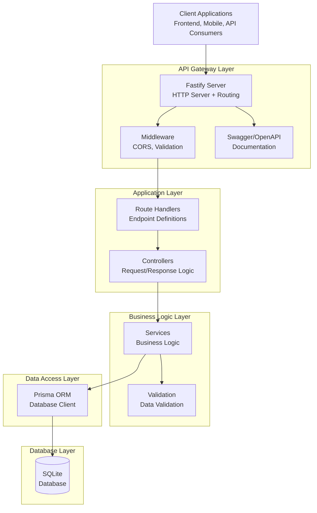
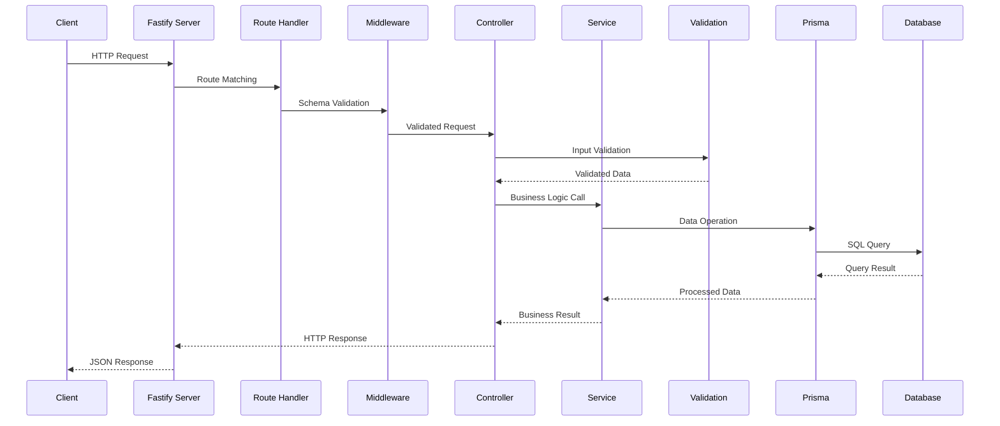

# PagePilot API Architecture Documentation

This document provides a comprehensive overview of the PagePilot backend API architecture, including design patterns, request flow, component interactions, and architectural decisions.

## 🏗️ Architecture Overview

PagePilot follows a **layered architecture pattern** with clear separation of concerns, making the codebase maintainable, testable, and scalable.



## 📐 Architectural Layers

### 1. **Presentation Layer** (Routes & Controllers)
**Responsibility**: Handle HTTP requests and responses

**Key Components**:
- **Routes** (`src/routes/`): Define API endpoints and their schemas
- **Controllers** (`src/controllers/`): Handle HTTP request/response cycle

### 2. **Business Logic Layer** (Services)
**Responsibility**: Implement core business rules and operations

**Key Components**:
- **Services** (`src/services/`): Business logic implementation
- **Validation** (`src/utils/validation.ts`): Business rule validation

### 3. **Data Access Layer** (Prisma)
**Responsibility**: Manage data persistence and retrieval

## 🔄 Request Flow Diagram



## 📂 Directory Structure & Responsibilities

```
src/
├── controllers/          # 🎮 HTTP Request Handlers
│   ├── authorController.ts      # Author CRUD operations
│   └── bookController.ts        # Book CRUD operations
│
├── routes/              # 🛣️ API Endpoint Definitions
│   ├── authorRoutes.ts         # Author API endpoints
│   └── bookRoutes.ts           # Book API endpoints
│
├── services/            # 🧠 Business Logic Layer
│   ├── authorService.ts        # Author business logic
│   └── bookService.ts          # Book business logic
│
├── utils/               # 🔧 Utility Functions
│   └── validation.ts           # Input validation
│
├── types/               # 📝 Type Definitions
│   └── index.ts               # API types and interfaces
│
├── database/            # 🗄️ Database Configuration
│   └── client.ts              # DB connection & utilities
│
├── generated/           # 🤖 Generated Code
│   └── prisma/               # Generated Prisma client
│
└── app.ts               # ⚙️ Application Configuration
```

## 🔒 Security Architecture

### Security Measures
1. **Input Validation**: Comprehensive schema validation at multiple layers
2. **SQL Injection Protection**: Prisma ORM with parameterized queries
3. **Type Safety**: TypeScript provides compile-time safety
4. **Error Handling**: Structured error responses

## 📊 API Documentation Architecture

### OpenAPI Integration

**Features**:
- **Auto-generated**: OpenAPI spec generated from Fastify schemas
- **Interactive**: Swagger UI for testing endpoints at `/docs`
- **Type-safe**: TypeScript integration for compile-time safety
- **Comprehensive**: All endpoints documented with examples

### Documentation Structure
```typescript
fastify.post('/authors', {
  schema: {
    tags: ['authors'],
    summary: 'Create a new author',
    body: createAuthorSchema,
    response: {
      201: {
        type: 'object',
        properties: {
          success: { type: 'boolean' },
          data: authorSchema,
        },
      },
    },
  },
  handler: authorController.createAuthor.bind(authorController),
});
```

## 🧪 Testing Architecture

### Test Structure
- **Service Tests**: Business logic testing with Vitest
- **Database Tests**: Full integration testing with SQLite
- **Isolation**: Each test cleans up data for consistency

### Test Implementation
```typescript
describe('AuthorService', () => {
  const authorService = new AuthorService();

  beforeEach(async () => {
    await prisma.book.deleteMany();
    await prisma.author.deleteMany();
  });

  test('should create a new author', async () => {
    const authorData = {
      name: 'J.K. Rowling',
      bio: 'British author, best known for the Harry Potter series',
      birthYear: 1965,
    };

    const author = await authorService.createAuthor(authorData);
    expect(author.name).toBe(authorData.name);
  });
});
```

## 🔧 Configuration Management

### Environment-based Configuration
```typescript
const PORT = process.env.PORT ? parseInt(process.env.PORT, 10) : 3000;
const HOST = process.env.HOST || '0.0.0.0';

export const prisma = new PrismaClient({
  log: ['query', 'info', 'warn', 'error'],
});
```

### Configuration Layers
1. **Environment Variables**: Database URLs, server configuration
2. **Default Values**: Development fallbacks
3. **Prisma Configuration**: Database connection and logging

## TODO:
- **Authentication**: JWT middleware can be added
- **Caching**: Redis integration possible at service layer
- **Rate Limiting**: Fastify plugins available
- **Microservices**: Services can be extracted to separate processes
 